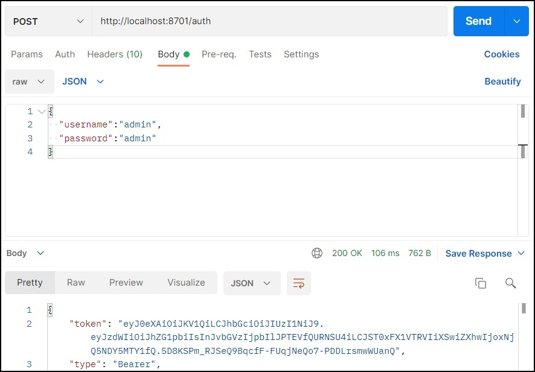

# Микросервис - Client for [UserService_main]
## Функционал:
* общение с MainApp посредством RestTemplate;
* API получения списка пользователей через MainApp; 
* данное API может использовать только пользователь с ролью ADMIN;
* покрытие Unit-тестами.

---
## Установка:
> Для развертывания в Докере, скачайте [docker-compose.yml] и запустите, набрав из консоли команду: **docker-compose up**

> Для запустка посредсвом IDE, MainApp должен быть запущен.

---
## Использование:
> Для взаимодействия с приложением необходимо использовать Postman (или его аналог). 

#### 1. Авторизация по логину и паролю, получиние Bearer токена: 
>POST: [localhost:8701/auth](http://localhost:8701/auth)

    {
      "username":"admin",
      "password":"admin"
    }

    {
      "username":"user",
      "password":"user"
    }

> В тело запроса (Body -> raw -> JSON) необходимо вставить пары "username":"логин", "password":"пароль" как показано на рисунке выше.

> После успешной авторизации, вы получите токен аутентификации (в теле ответа), который вам понадобиться на следующем шаге.
---
#### 2. Аутентификация, получение ресурсов (список пользователей):
> GET: [localhost:8701/list](http://localhost:8701/list)

> Чтобы получить ресурсы, необходимо пройти аутентификацию, путем добавления заголовка  
> "Authorization" со значением "Bearer ваш_токен" как показано на рисунке выше. 

> Вместо заголовка можно использовать вкладку Auth -> Type (Bearer Token) -> ваш_токен.

> Список ресурсов доступен только для пользователей с правами ROLE_ADMIN 
